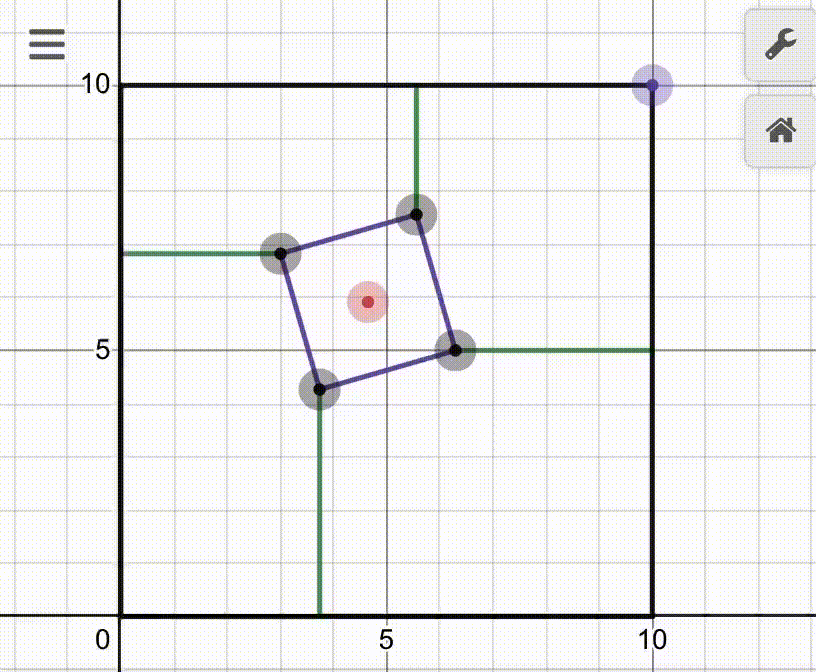
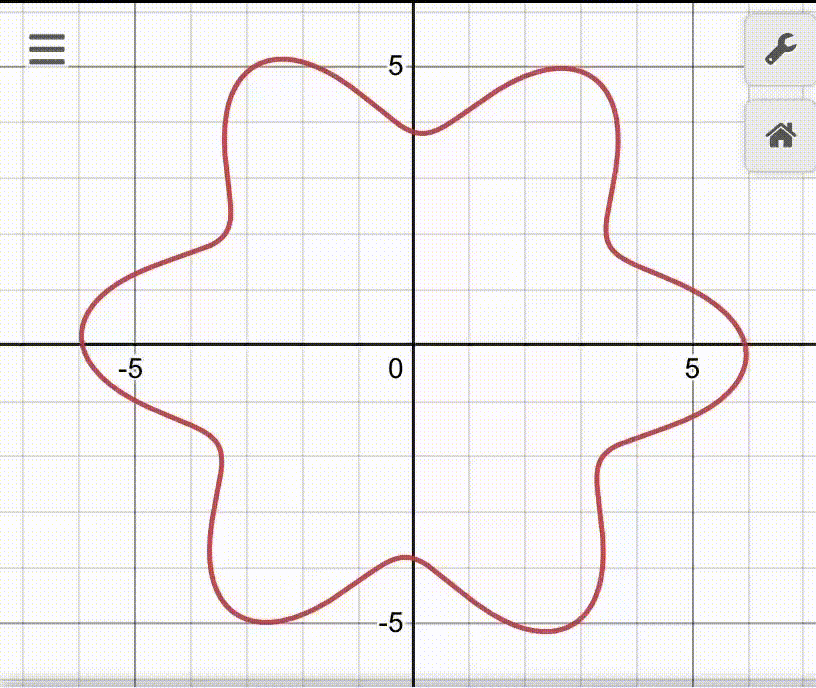
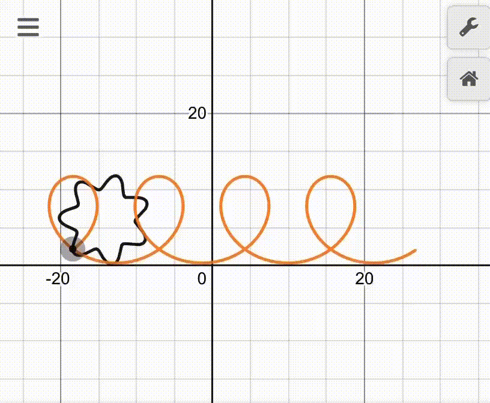
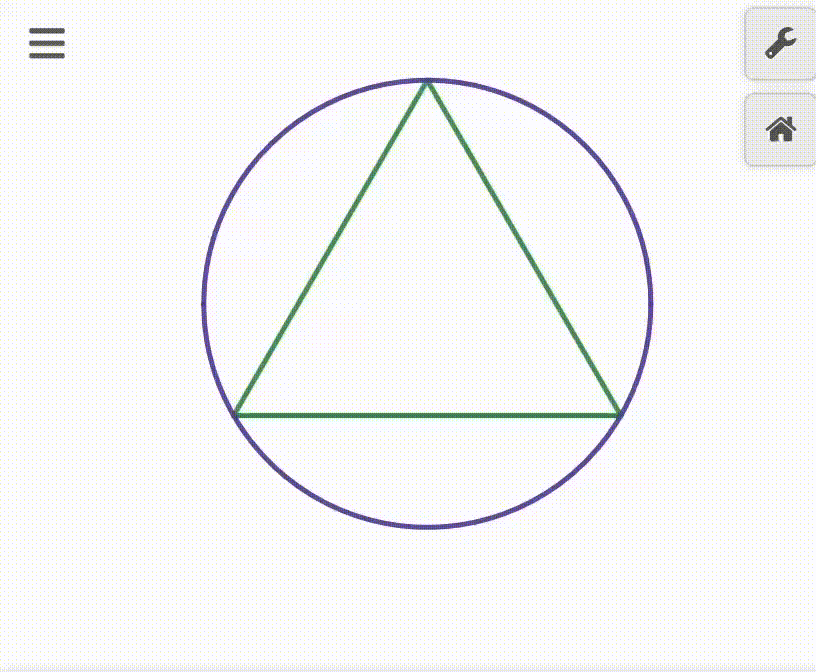

# Desmos-projects
There is all links on my personal desmos projects

## Calculus section

  ### Project 1: Illustration of transformation (x,y) point that lies on circle to differentiable complex functon 
  
  

  [Click here to see the graph](https://www.desmos.com/calculator/6ed1mwqiet)

## Physics section

  ### Project 2: Ellipse under the influence of gravity

  
  
  [Click here to see the graph](https://www.desmos.com/calculator/shxjzjg0fj)

## Geometry section

  ### Project 3: Box inside another box that rotates
  
  

  [Click here to see the graph](https://www.desmos.com/calculator/wcuegbxqed)

  ### Project 4: Rotation of (x(t),y(t)) function around the Ox,Oy,Oz
  
  

  [Click here to see the graph](https://www.desmos.com/calculator/norf8vbtum)

  ### Project 5: Path of wheel's fixed point illustration 
  
  

  [Click here to see the graph](https://www.desmos.com/calculator/hiem0yugsf)

  ### Project 6: Increasing function f(x) = ax + b thickness
  
  

  [Click here to see the graph](https://www.desmos.com/calculator/bt3tnfnrli)

  ### Project 7: Illustration of apeirogon 
  
  
  
  [Click here to see the graph](https://www.desmos.com/calculator/eextmhoxnh)

  ### Project 8: All triangle formulas illustration
  
  

  [Click here to see the graph](https://www.desmos.com/calculator/blmahpkmdr)

## Drawing section

  ### Project 9: Madara + Sasuke EMS
  
  
  
  [Click here to see the graph](https://www.desmos.com/calculator/bd5ffn5xdp)
  
  ### Project 10: Madara EMS
  
  
  
  [Click here to see the graph](https://www.desmos.com/calculator/co07ensmfq)
  
  ### Project 11: Sasuke EMS
  
  
  
  [Click here to see the graph](https://www.desmos.com/calculator/mltktm9vqx)
  
  ### Project 12: Izuna MS
  
  
  
  [Click here to see the graph](https://www.desmos.com/calculator/smp78kykky)
  
  ### Project 13: Madara MS
  
  
  
  [Click here to see the graph](https://www.desmos.com/calculator/yzmuu5g8a4)
  
  ### Project 14: Shisui MS
  
  
  
  [Click here to see the graph](https://www.desmos.com/calculator/xa42ytbxkz)

  ### Project 15: Sasuke MS
  
  
  
  [Click here to see the graph](https://www.desmos.com/calculator/psgkk879p7)

